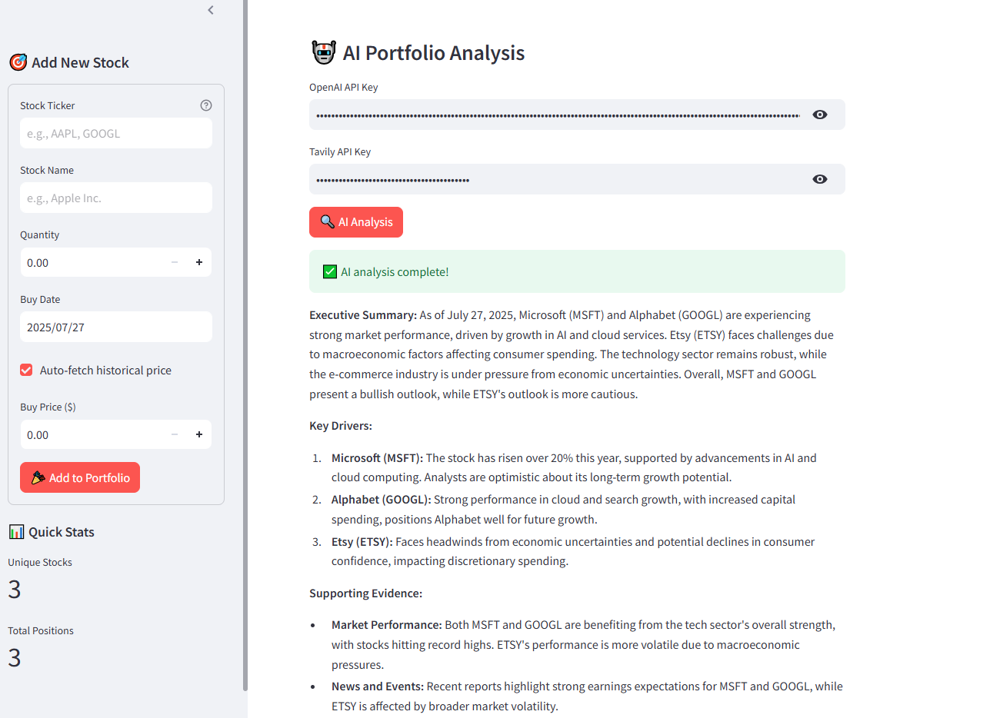

# 🧠 AI-Powered Portfolio Manager



**Advanced Portfolio Intelligence System with AI-Driven Stock Analysis**

A sophisticated financial technology platform that combines real-time market data, intelligent portfolio management, and cutting-edge AI analysis to provide comprehensive investment insights and early warning indicators for your stock portfolio.

## 🤖 AI-Powered Stock Analysis Engine

### Intelligent Market Intelligence
Our AI agent leverages advanced language models and real-time market data to provide comprehensive stock analysis:

- **🔍 Real-Time Market Research**: AI-powered web search integration using Tavily API for latest financial news and market sentiment
- **📊 Multi-Factor Analysis**: Comprehensive evaluation of financial metrics, market trends, and company fundamentals
- **⚡ Automated Risk Assessment**: Early warning detection for potential portfolio risks and opportunities
- **📈 Predictive Insights**: AI-driven analysis of market patterns and stock performance indicators
- **🎯 Personalized Recommendations**: Tailored investment insights based on your specific portfolio composition

### Advanced AI Architecture
Built on **LangChain REACT framework** with **OpenAI GPT-4** integration:

```python
# AI Agent Core Features
- Language Model: OpenAI GPT-4 (temperature=0 for consistent analysis)
- Search Integration: Tavily API for real-time financial data
- Reasoning Framework: LangChain REACT agent with 10-step iteration limit
- Analysis Depth: Multi-layered stock evaluation with market context
```

## 🚀 Core Platform Features

### 📊 Intelligent Portfolio Management
- **Smart Stock Addition**: Automated ticker validation and company data retrieval
- **Real-Time Price Engine**: Yahoo Finance integration with rate limiting protection
- **AI-Enhanced Analytics**: Machine learning-powered performance insights
- **Dynamic Risk Monitoring**: Continuous portfolio health assessment

### 📈 Advanced Analytics Dashboard
- **Interactive Performance Charts**: Plotly-powered visualizations with time-series analysis
- **Portfolio Optimization Metrics**: Comprehensive return calculations and risk assessment
- **AI-Driven Insights Panel**: Real-time analysis results and recommendations
- **Predictive Performance Modeling**: Historical trend analysis with future projections

### � Professional Features
- **Enterprise-Grade UI**: Modern gradient design with responsive architecture
- **Secure Data Management**: CSV-based portfolio storage with backup capabilities
- **API Rate Limiting**: Robust error handling and connection management
- **Multi-Platform Compatibility**: Cross-platform support with mobile optimization

## 🏗️ Technical Architecture

### AI Analysis Pipeline
```
Portfolio Data → AI Agent → Market Research → Analysis Engine → Insights Dashboard
     ↓              ↓           ↓              ↓                ↓
  CSV Storage → LangChain → Tavily API → GPT-4 Model → Streamlit UI
```

### Technology Stack
- **Frontend**: Streamlit 1.39.0 (Professional web framework)
- **AI Engine**: LangChain + OpenAI GPT-4 (Advanced reasoning)
- **Market Data**: Yahoo Finance + Tavily Search API
- **Visualization**: Plotly 5.24.1 (Interactive charts)
- **Data Processing**: Pandas 2.2.3 + NumPy (High-performance analytics)

## ⚡ Quick Start Guide

### Prerequisites
- Python 3.8+
- OpenAI API Key
- Tavily API Key

### Installation

1. **Clone the repository**:
```bash
git clone https://github.com/yourusername/ai-portfolio-early-warning.git
cd ai-portfolio-early-warning
```

2. **Install dependencies**:
```bash
pip install -r requirements.txt
```

3. **Configure API Keys**:
```bash
# Create environment file
echo "OPENAI_API_KEY=your_openai_key_here" > .env
echo "TAVILY_API_KEY=your_tavily_key_here" >> .env
```

4. **Launch the application**:
```bash
streamlit run portfolio_app.py
```

5. **Access the platform**: Navigate to `http://localhost:8501`

### AI Analysis Activation

**Get AI-powered insights**:
1. Add stocks to your portfolio using the sidebar
2. Click "🤖 Get AI Analysis" for any stock
3. Receive comprehensive AI-generated market intelligence
4. Monitor early warning indicators in real-time

## � AI Analysis Features

### 🧠 Intelligent Stock Evaluation
The AI agent performs multi-dimensional analysis including:

- **Financial Health Assessment**: Revenue trends, profit margins, debt ratios
- **Market Sentiment Analysis**: News sentiment, analyst recommendations, social media trends
- **Technical Indicators**: Moving averages, RSI, MACD, support/resistance levels
- **Competitive Positioning**: Industry comparison and market share analysis
- **Risk Factor Identification**: Potential threats and opportunities

### 📈 Early Warning System
Advanced algorithms detect:

- **Price Movement Anomalies**: Unusual trading patterns and volume spikes
- **Earnings Risk Indicators**: Pre-earnings volatility and expectation gaps
- **Market Correlation Shifts**: Changes in stock relationships and sector rotation
- **Sentiment Deterioration**: Negative news momentum and analyst downgrades
- **Technical Breakdown Signals**: Chart pattern failures and support breaches

### 🎯 Personalized Recommendations
AI-generated insights tailored to your portfolio:

- **Position Sizing Advice**: Optimal allocation recommendations
- **Risk Management Alerts**: Portfolio concentration warnings
- **Diversification Opportunities**: Sector and geographic balance suggestions
- **Exit Strategy Signals**: Stop-loss and profit-taking recommendations
- **Entry Point Optimization**: Timing suggestions for new positions

## 📋 Portfolio Management

### Adding Stocks
**Professional stock entry system**:
- **Ticker Validation**: Real-time symbol verification
- **Auto-Complete**: Automatic company name population
- **Purchase Details**: Date, price, and quantity tracking
- **Instant Valuation**: Immediate portfolio impact calculation

### Performance Analytics
**Comprehensive portfolio insights**:
- **Time-Series Analysis**: 1M, 3M, 6M, 1Y, 2Y performance tracking
- **Benchmark Comparison**: Relative performance vs market indices
- **Risk Metrics**: Volatility, Sharpe ratio, maximum drawdown
- **Correlation Analysis**: Portfolio diversification assessment

### Data Management
**Enterprise-level data handling**:
- **CSV Backend**: Reliable file-based storage with versioning
- **Export Capabilities**: Portfolio data download in multiple formats
- **Backup System**: Automated data protection and recovery
- **Import Function**: Bulk portfolio upload from external sources

## 🎨 User Interface

### Professional Design System
- **Modern UI Components**: Gradient cards with professional styling
- **Responsive Layout**: Optimized for desktop, tablet, and mobile
- **Interactive Elements**: Hover effects and smooth animations
- **Dark/Light Themes**: Customizable interface preferences

### Dashboard Components
- **Portfolio Overview**: Key metrics and performance summary
- **Holdings Table**: Detailed position management with sorting
- **Performance Charts**: Interactive visualizations with zoom capabilities
- **AI Insights Panel**: Real-time analysis results and recommendations

## 🔧 Technical Specifications

### Dependencies
```python
# Core Framework
streamlit==1.39.0

# AI & Machine Learning
langchain
langchain-community
langchain-openai
langchain-tavily
openai

# Financial Data
yfinance==0.2.38
tavily-python

# Data Processing
pandas==2.2.3
numpy

# Visualization
plotly==5.24.1

# Utilities
python-dotenv
requests
```

### System Requirements
- **Python**: 3.8 or higher
- **Memory**: 2GB RAM minimum, 4GB recommended
- **Storage**: 100MB for application + data storage
- **Network**: Internet connection for real-time data
- **APIs**: OpenAI and Tavily API access

### Performance Optimizations
- **Rate Limiting**: Intelligent API call management
- **Caching**: Efficient data retrieval and storage
- **Lazy Loading**: On-demand component initialization
- **Error Handling**: Graceful degradation for network issues

## 🔐 Security & Privacy

### API Key Management
- **Environment Variables**: Secure credential storage
- **Git Exclusion**: Comprehensive .gitignore configuration
- **Key Validation**: Startup verification of API access
- **Error Masking**: Safe error reporting without credential exposure

### Data Protection
- **Local Storage**: Portfolio data remains on user's system
- **No Cloud Dependencies**: Optional cloud features only
- **Encryption Ready**: Prepared for data encryption implementation
- **GDPR Compliance**: Privacy-first architecture

## 🚀 Advanced Features

### AI Analysis Capabilities
- **Real-Time Research**: Live market data integration
- **Sentiment Tracking**: News and social media analysis
- **Pattern Recognition**: Technical and fundamental patterns
- **Risk Modeling**: Sophisticated risk assessment algorithms

### Portfolio Optimization
- **Rebalancing Suggestions**: AI-powered allocation optimization
- **Tax Efficiency**: Capital gains/loss optimization strategies
- **Dividend Tracking**: Income-focused portfolio analysis
- **Correlation Monitoring**: Diversification effectiveness tracking

### Professional Analytics
- **Performance Attribution**: Factor-based return analysis
- **Stress Testing**: Portfolio resilience under market scenarios
- **Monte Carlo Simulation**: Probabilistic outcome modeling
- **Beta Analysis**: Market sensitivity measurement

## 🔮 Roadmap & Future Enhancements

### Upcoming Features
- **🔔 Smart Alerts**: Customizable notification system
- **📊 Advanced Charts**: Professional charting suite
- **🌐 Multi-Asset Support**: Bonds, ETFs, crypto integration
- **📱 Mobile App**: Native iOS/Android applications
- **☁️ Cloud Sync**: Optional cloud portfolio synchronization

### AI Enhancements
- **🤖 GPT-4 Turbo**: Enhanced model integration
- **📈 Predictive Models**: Machine learning forecasting
- **🎯 Strategy Backtesting**: Historical strategy validation
- **🔍 Fundamental Analysis**: Deep company research automation

### Professional Features
- **👥 Multi-User Support**: Team collaboration features
- **🔐 Enterprise Security**: Advanced authentication
- **📊 Custom Reporting**: Branded report generation
- **🔌 API Access**: External system integration

---
Link for Streamlit community cloud - https://aiportmanagerbymb.streamlit.app/